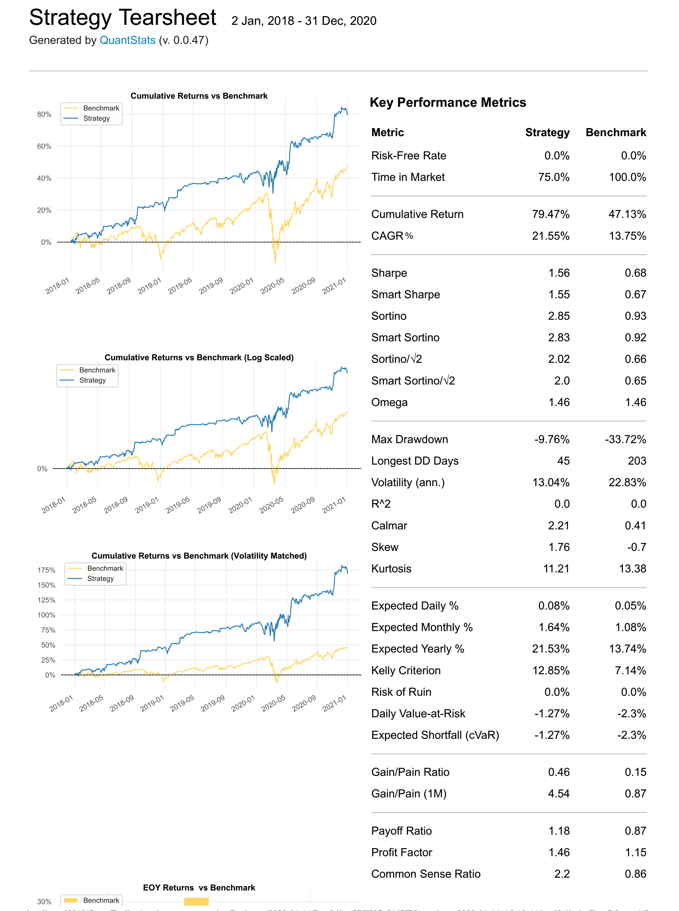
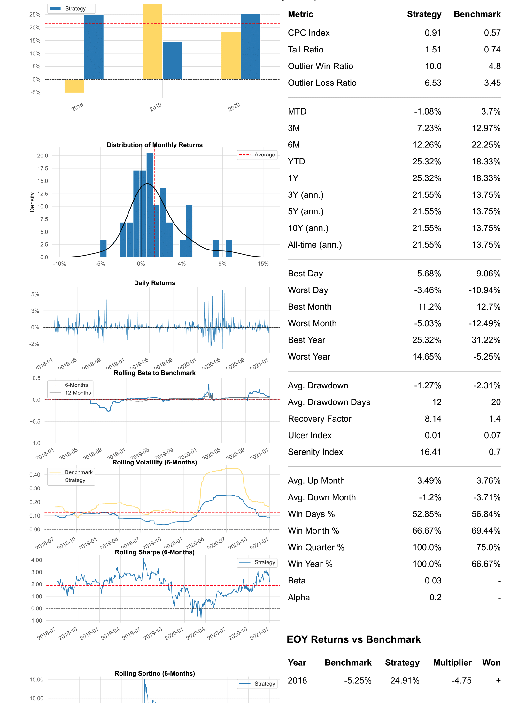

# Quantitative Trading Project

Quantitative trading project implementing strategies mentioned in the book "Algorithmic Traading" by Ernest P. Chan.

### Overview
* Goal: To implement a mean reversion trading strategy using cointegrated stocks
* 15 constructed portfolios had a better Sharpe Ratio than benchmark (SPY)
* Best Result (BKNG and SIRI):
  * Return: 79.47% (compared to 47.13% return of SPY)
  * Sharpe Ratio: 1.56 (compared 0.68)
  * Beta: 0.03 (uncorrelated returns to the market)
  * Max Drawdown: -9.76% (compared to benchmark, -33.72%)

### Tools
* Pandas
* Backtrader
* Quantstats
* Sqlite

---

### Step 1: Cointegration Test
First, the data was split into training and testing: 
* Training period: 2014-2017
* Testing period: 2018-2020

I used the Engle-Granger test to find which stock pairs in the S&P 500 index are cointegrated. 
The following heatmap shows the cointegrated stock pairs and the correlations between the stocks.

|   Cointegration Table   |  Correlation Table  |
|:-----------------------:|:-------------------:|
|  |  |

---

### Step 2: Backtesting
Stationary portfolios were constructed using the cointegrated stock pairs. Backtesting was conducted using the Backtrader package.
Trading strategy was to take a position proportional to the number of negative standard deviations away from the mean. 
This was done for all the cointegrated stock pairs. Below is an example of a stationary portfolio constructed using ALXN and LBTYK.

### Step 3: Optimal Portfolios
Portfolio statistics were calculated using the package Quantstats. 
The following table shows the portfolio performance statistics of a few select portfolios. 

| Portfolio                          |Total Log Return   |Alpha              |Beta                 |CAGR%              |Sharpe            |Sortino           |Max Drawdown|Volatility         |R2                   |Calmar            |Skew              |Kurtosis          |Expected Return       |Kelly              |Risk of Ruin|Daily VaR            |VaR                  |Expected Shortfall   |Daily Expected Shortfall|Payoff Ratio      |Profit Factor     |UPI               |Win Rate          |Best  |Worst  |
|------------------------------------|-------------------|-------------------|---------------------|-------------------|------------------|------------------|------------|-------------------|---------------------|------------------|------------------|------------------|----------------------|-------------------|------------|---------------------|---------------------|---------------------|------------------------|------------------|------------------|------------------|------------------|------|-------|
| 2BKNG-516SIRI  |0.3593             |0.186246548        |-0.019374066         |0.197292286        |2.066886882       |3.872781543       |-1          |0.088981604        |0.001059704          |4.407068698       |1.669768659       |11.10107626       |0.000714248           |0.211842908        |7.13E-267   |-0.0084901           |-0.0084901           |-0.014166667         |-0.014166667            |1.376109682       |1.638656924       |44.11380428       |0.543543544       |0.0416|-0.0236|
| 12ALXN-36LBTYK |0.1881             |0.069391365        |-0.015927211         |0.067790147        |1.226295752       |2.122967697       |-1          |0.054648009        |0.004579482          |2.066951249       |2.18029897        |23.34602693       |0.000260044           |0.126711733        |0           |-0.005396479         |-0.005396479         |-0.008180952         |-0.008180952            |1.223128509       |1.322569851       |29.90122609       |0.51953125        |0.0371|-0.0169|
| 1BKNG-28EBAY   |0.383              |0.130443854        |0.023377455          |0.136256583        |1.177114101       |2.164535532       |-1          |0.113894368        |0.002195017          |1.462304886       |2.092031412       |12.96714985       |0.000506567           |0.108563794        |0           |-0.011269273         |-0.011269273         |-0.016171429         |-0.016171429            |1.323928086       |1.283020196       |21.16274347       |0.492154066       |0.0584|-0.0278|
| 1BKNG-14XEL    |0.2849             |0.103988529        |-0.033480792         |0.100061695        |1.176661113       |2.025693431       |-1          |0.083966402        |0.008284083          |0.941565966       |1.364697339       |9.178137148       |0.000378163           |0.105857143        |0           |-0.008308202         |-0.008308202         |-0.012008333         |-0.012008333            |1.353892441       |1.278676194       |12.1729218        |0.485714286       |0.0345|-0.0276|
| 13DLTR-13MNST  |0.2791             |0.097802086        |-0.008402164         |0.097471163        |1.135047157       |2.281689462       |-1          |0.085018494        |0.000508911          |1.344949693       |3.940537441       |36.31992824       |0.000368813           |0.121455442        |0           |-0.008426343         |-0.008426343         |-0.011385714         |-0.011385714            |1.283382602       |1.315668956       |21.3167903        |0.50621118        |0.0635|-0.0161|
| 13ALXN-39LBTYA |0.1808             |0.067935508        |-0.021311375         |0.064888408        |1.035792477       |1.688967029       |-1          |0.062517649        |0.006264753          |1.651215037       |1.57631938        |17.9527452        |0.000249254           |0.10421688         |0           |-0.006220866         |-0.006220866         |-0.00964             |-0.00964                |1.186995738       |1.254438678       |21.55126972       |0.513812155       |0.0395|-0.0186|

### Step 4: Quantstats 

The following is an example tearsheet generated by Quantstats. Here I am showing the portfolio "2 BKNG - 516 SIRI" 
(long 2 shares of BKNG, short 516 shares of SIRI). The benchmark was chosen to 
be the S&P 500 index fund SPY. 

* This portfolio outperforms the benchmark: 43% (compared to 24%)
* Sharpe ratio: 1.56 (compared to 0.68)
* Max Drawdown: -9.76% (compared to -33.72%)
* Beta: 0.03.

  

